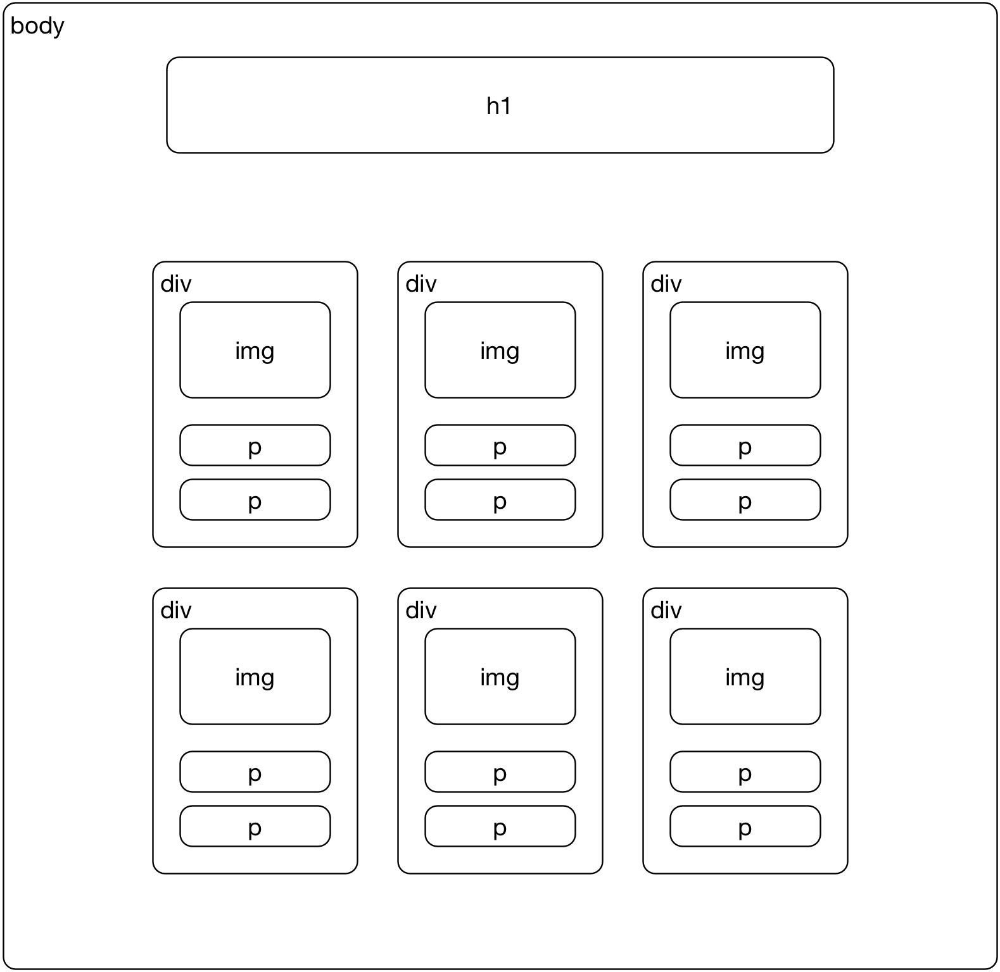

**OBS: É importante que você gere um commit para cada parte da atividade que você concluir.**

# Galeria de Filmes

Você recebeu junto deste projeto a página `index.html` que deveria representar uma galeria de filmes. Contudo, nenhum estilo foi aplicado a esta página ainda (por isso ela está horrível). Os exercícios consistem em aplicar customizações CSS de forma a tornar essa galeria de filmes bonita para se mostrar aos seus amigos.

## Layout Principal (Page Layout)

Ao se estruturar uma página web, o primeiro ponto a se pensar é como será sua estrutura geral. Ao se fazer uma galeria, geralmente as imagens são exibidas em formato de grade, de forma que o usuário consiga visualizar todos os itens inicialmente. 

Utilize a técnica de Layout Híbrido visto na aula de **Page Layout** para estruturar a página utilizando um layout de 12 colunas, dividida de acordo com a figura abaixo:

## Estilização (CSS3)

De nada adianta um página estruturada se a aparência de seu conteúdo machuca os olhos!! É hora de utilizar algumas das propriedades vistas em CSS3 para dar um efeito cinematográfico em nossa galeria.

### Título de Impacto

Utilize as propriedades de efeito de texto para criar um título que impacte os usuários que irão visitar a página. É possível que seja necessário utilizar uma fonte diferente das convencionais para trazer esse impacto a sua página. Pesquise uma fonte no [Google Fonts](https://fonts.google.com) que se encaixe com suas demandas.

### Transformando Filmes em Cartões

Você pode utilizar propriedades CSS para dar destaque a cada filme da galeria. Utilize as propriedades de borda e background para dar destaque a cada filme exibido na galeria. Você pode utilizar sombra nas bordas dos filmes para "destacá-los" do fundo, **ou**  alterar a cor da `div` para dar o destaque e utilizar bordas arredondadas.

### Exibindo Galeria com Estilo

Cinema é movimento! Adicione uma animação que mostre os filmes da galeria com estilo após carregamento da página. Você deverá pesquisar sobre a propriedade `animation` para entender o que pode ser customizado. Dê uma olhada neste [link](https://www.w3schools.com/cssref/css3_pr_animation.asp).

### Interagindo com os Filmes

Ao interagir com um dos filmes da galeria, é ideal que este filme ganhe destaque sobre os demais. Utilize as técnicas de transição vistas na aula de **CSS3** para dar um efeito de zoom de 200% nos filmes onde o usuário interage no momento.
